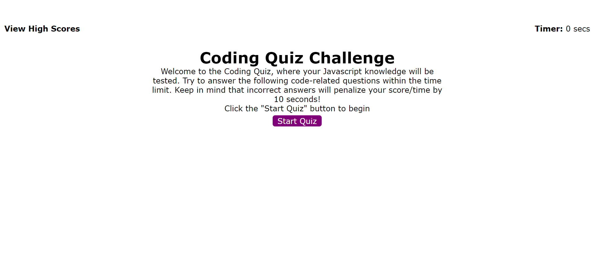

# :hourglass: :memo:The Web APIs Code Quiz Challenge :memo: :hourglass:

## Overview :book:
For this challenge I was assigned to build a timed coding quiz with multiple-choice questions.  Utilizing a Web Application Programming Interface (API), this app features HTML and CSS powered by Javascript.


### User Story :notebook_with_decorative_cover:
```
AS A coding boot camp student
I WANT to take a timed quiz on JavaScript fundamentals that stores high scores
SO THAT I can gauge my progress compared to my peers
```

### Client's Acceptance Criteria :pencil2:
```
GIVEN I am taking a code quiz
WHEN I click the start button
THEN a timer starts and I am presented with a question
WHEN I answer a question
THEN I am presented with another question
WHEN I answer a question incorrectly
THEN time is subtracted from the clock
WHEN all questions are answered or the timer reaches 0
THEN the game is over
WHEN the game is over
THEN I can save my initials and score
```

---
## Features

* Dynamically updated HTML
* CSS
* Javascript
* Timer
* Local storage
* a Web API
* DOM elements

---

## :link: Link to Webpage

Click the following link to visit the webpage:

[A live link to the webpage](https://adorsey5.github.io/pwd-generator/)


The following image is a screenshot of the webpage:



---
## :capital_abcd:Languages and Technology Used :computer:

### Languages
* HTML
* CSS
* Javascript


### Technology

* VSCode
* GitBash
* Emojis from "Markdown Emoji" VSCode extension *

---

## Acknowledgments

For my fourth challenge I had a great deal of guidance from:

 * UM Coding Bootcamp Modules/GitLab Respository
 * UM Coding Bootcamp instructor and teacher assistants (TAs)
 * UM Coding Bootcamp Tutor: Jeremy Jones
 * UM Coding Bootcamp Classmates
 * GitHub
 * Google


 ---

- - -
© 2022 Asha Dorsey